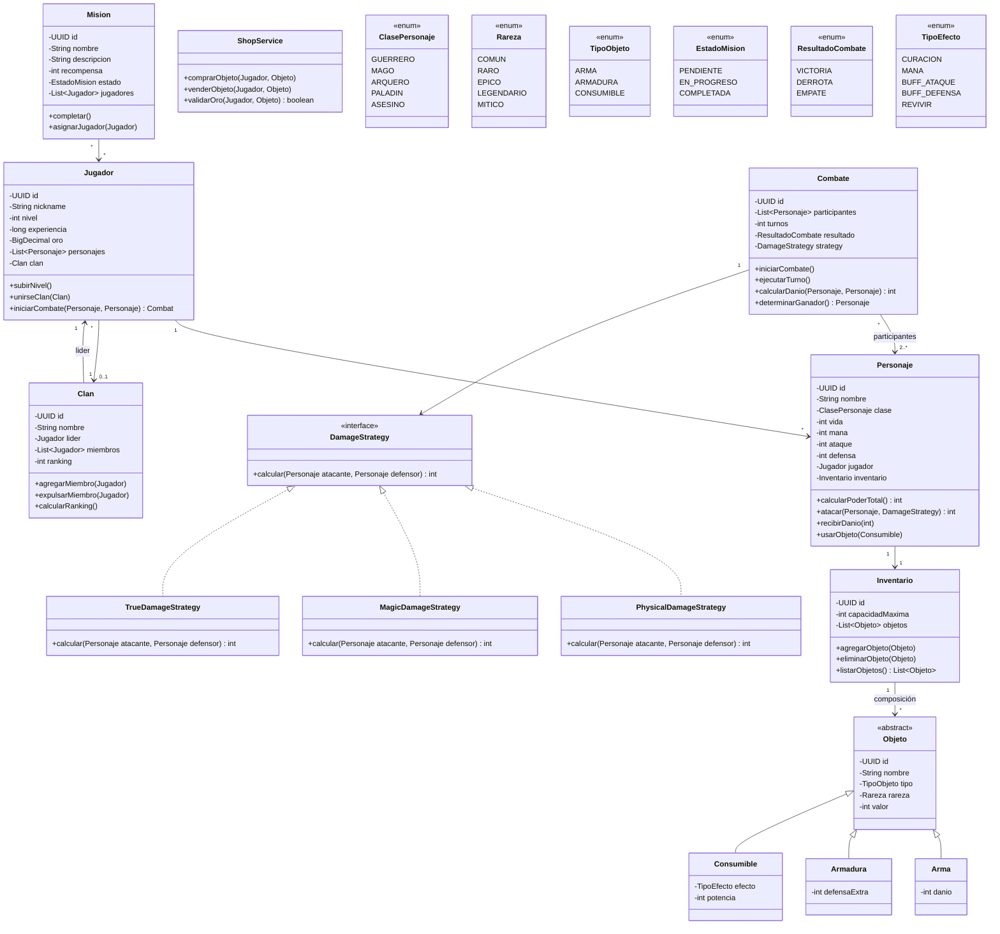

# RPG Online - Análisis de Dominio y Diseño Arquitectónico

## 1. Identificación de Clases

| Clase | Capa | Responsabilidad |
|-------|------|----------------|
| **Jugador** | Domain | Agregado raíz. Gestiona progresión (nivel, experiencia, oro) y relación con personajes y clan |
| **Personaje** | Domain | Entidad hija. Encapsula estadísticas de combate (vida, mana, ataque, defensa) y acciones |
| **Inventario** | Domain | Value Object (composición). Contiene y gestiona objetos del personaje |
| **Objeto** | Domain | Clase base abstracta para items. Herencia: Arma, Armadura, Consumible |
| **Arma** | Domain | Especialización de Objeto con daño |
| **Armadura** | Domain | Especialización de Objeto con defensaExtra |
| **Consumible** | Domain | Especialización de Objeto con efecto |
| **Clan** | Domain | Agregado. Gestiona miembros, liderazgo y ranking |
| **Combate** | Domain | Entidad. Orquesta turnos, cálculo de daño y determinación de ganador |
| **Mision** | Domain | Entidad. Gestiona progresión de misiones con estado (PENDIENTE, EN_PROGRESO, COMPLETADA) |
| **ShopService** | Domain Service | Lógica de transacciones: compra/venta con validación de oro |

## 2. Responsabilidades por Capa (Clean Architecture)

- **Domain**: Entidades, Value Objects, Enums, Interfaces de repositorio, Servicios de dominio
- **Application**: DTOs, Mappers (MapStruct), Use Cases (orquestación)
- **Infrastructure**: Implementaciones JPA, Configuración, Seguridad
- **Presentation**: Controladores REST, Exception Handler

## 3. Relaciones

```
Jugador 1 ──── * Personaje
Jugador * ──── 0..1 Clan
Personaje 1 ──── 1 Inventario
Inventario * ──── Objeto (composición)
Objeto △── Arma, Armadura, Consumible (herencia)
Combate * ──── 2..* Personaje (participantes)
Mision * ──── * Jugador
```

## 4. Justificación de Diseño

Se opta por **Clean Architecture + DDD** para:
- **Aislamiento del dominio**: La lógica de negocio no depende de frameworks ni infraestructura
- **Testabilidad**: Cada capa puede probarse de forma aislada
- **Escalabilidad**: Preparado para división en microservicios (ej: CombatService como servicio independiente)
- **Mantenibilidad**: Bajo acoplamiento mediante interfaces y DI

## 5. Patrones de Diseño

| Patrón | Uso | Justificación |
|--------|-----|---------------|
| **Strategy** | Cálculo de daño (PhysicalDamageStrategy, MagicDamageStrategy, TrueDamageStrategy) | Permite añadir nuevos tipos de daño sin modificar el combate |
| **Builder** | Construcción de entidades complejas (Jugador, Personaje, Combate) | Evita telescoping de constructores |
| **Repository** | Acceso a datos (interfaces en domain, impl en infrastructure) | Abstrae la persistencia del dominio |
| **DTO** | Transferencia de datos entre capas | Evita exponer entidades en la API |
| **Factory** | Creación de objetos/armas | Centraliza lógica de creación |
| **Global Exception Handler** | Manejo de errores (@RestControllerAdvice) | Consistent error responses |

## 6. Principios SOLID Aplicados

| Principio | Aplicación |
|-----------|------------|
| **S** | Cada clase tiene una única responsabilidad (ej: DamageStrategy solo calcula daño) |
| **O** | Herencia de Objeto permite extensiones sin modificar código existente |
| **L** | Arma, Armadura, Consumible sustituyen a Objeto sin alterar el comportamiento |
| **I** | Interfaces segregadas: DamageStrategy, CrudService, Combatible |
| **D** | Domain no depende de infraestructura; repositorios se inyectan como interfaces |

## 7. Riesgos Técnicos

| Riesgo | Mitigación |
|--------|------------|
| **Sobrecarga de JOINs** en consultas JPA | Usar FetchType.LAZY, @EntityGraph, proyecciones |
| **Transacciones largas** en combates | Diseñar Combate como saga (event-driven a futuro) |
| **Concurrencia en economía** | Optimistic Locking (@Version) en Jugador.oro y Objeto |
| **Deuda técnica por herencia JPA** | Usar SINGLE_TABLE con @DiscriminatorColumn para rendimiento |
| **Escalabilidad de clanes** | Índices en nombre_clan y lider_id |

## 8. Estrategia de Escalabilidad

- **Base de datos**: Índices compuestos en (jugador_id, personaje_id), (clan_id, nombre), tablas normalizadas 3FN
- **Caché**: Preparar Redis para consultas frecuentes (ranking, items de tienda)
- **Event Sourcing** futuro: CombatEvent, TradeEvent, LevelUpEvent
- **Microservicios candidatos**: CombatService (alta carga), ShopService (consistencia transaccional)
- **Read Models**: CQRS futuro para consultas de ranking y catálogo
- **Sharding**: Por ID de jugador (vertical) o por región (horizontal)

---

## PARTE B - Diagrama UML Mermaid



---
