# RPG Online - Extensión: Sistemas Avanzados

## 1. Explicación Arquitectónica

La extensión sigue los mismos principios de Clean Architecture + DDD:

```
Console (UI/Adapter) → Domain (Core) → Infrastructure (Persistence)
```

**Nuevos módulos**:
- **domain/experience/**: Sistema de progresión (Strategy Pattern para curvas de XP)
- **domain/skill/**: Sistema de habilidades (herencia + Factory Pattern)
- **domain/effect/**: Sistema de estados alterados (State Pattern)
- **infrastructure/persistence/json/**: Persistencia simulada tipo Prisma (Repository Pattern)
- **console/**: Interfaz de consola retro (MVC: Model-Domain, View-Renderer, Controller-Screens)

## 2. Sistema de Experiencia

### Diseño
```
ExperienceStrategy (interface)
  ├── QuadraticExpStrategy: exp = nivel² * K (K=100 por defecto)
  ├── LinearExpStrategy: exp = nivel * K
  └── FibonacciExpStrategy: exp = fib(n) * K

ExperienceManager: Orquesta cálculo de XP + subidas de nivel
CharacterProgression: Wrapper que combina XP + Skills + Efectos
LevelUpReward: Recompensas por clase al subir nivel
RewardFactory: Crea recompensas según clase
```

### Fórmula de ejemplo
| Nivel | Quadratic (K=100) | Linear (K=200) | Fibonacci (K=50) |
|-------|-------------------|-----------------|-------------------|
| 1     | 100               | 200             | 50                |
| 2     | 400               | 400             | 50                |
| 3     | 900               | 600             | 100               |
| 5     | 2500              | 1000            | 250               |
| 10    | 10000             | 2000            | 2750              |

### Recompensas por clase
- **Guerrero**: +15 Vida, +3 Maná, +3 Ataque, +2 Defensa
- **Mago**: +5 Vida, +10 Maná, +3 Ataque, +1 Defensa
- **Arquero**: +8 Vida, +5 Maná, +3 Ataque, +1 Defensa
- **Paladín**: +12 Vida, +6 Maná, +2 Ataque, +3 Defensa
- **Asesino**: +7 Vida, +4 Maná, +4 Ataque, +1 Defensa

## 3. Sistema de Habilidades

### Jerarquía
```
Habilidad (abstract)
  ├── HabilidadOfensiva: multiplicador de daño, ignora defensa parcial
  ├── HabilidadCurativa: cura según poder + ataque base
  └── HabilidadBuff: aplica estados alterados (PROTEGIDO, FORTALECIDO, ENVENENADO)

SkillFactory: Crea 5 habilidades por clase (3 ofensivas, 1 buff, 1 curativa)
SkillManager: Gestiona desbloqueo, cooldown, maná, uso
```

### Habilidades por clase (5 cada una)

| Clase | Habilidad 1 (Nv.1) | Habilidad 2 (Nv.2) | Habilidad 3 (Nv.3) | Habilidad 4 (Nv.4) | Habilidad 5 (Nv.5-6) |
|-------|-------------------|--------------------|--------------------|--------------------|---------------------|
| Guerrero | Golpe Poderoso (atq 1.5x) | Escudo Defensivo (buff) | Tajo Giratorio (2x) | Resistencia (cura) | Furia (2.5x) |
| Mago | Bola de Fuego (1.8x) | Toque de Vida (cura) | Rayo Helado (-) | Escudo Arcano | Tormenta (3x) |
| Arquero | Flecha Precisa (1.4x) | Ojo de Águila (buff) | Lluvia Flechas (2.2x) | Aliento Vida | Disparo Penetrante |

### Integración con combate
- Las habilidades se usan durante el combate por turnos
- Consumen maná del personaje
- Tienen cooldown (no se pueden reutilizar inmediatamente)
- Los personajes pueden alternar entre ataque normal y habilidades
- HabilidadOfensiva calcula daño con: `(ataque + danioBase) * multiplicador + nivel * 2`
- HabilidadCurativa calcula curación con: `(curacionBase + ataque/2) * multiplicador`
- HabilidadBuff aplica estados alterados gestionados por EffectManager

## 4. Persistencia Simulada (Prisma-like)

### Arquitectura
```
JsonDatabase: Gestor central de archivos JSON con ObjectMapper (Jackson)
DataStore: Fachada que expone repositorios tipados
GenericRepository<T>: Interfaz universal (save, findById, findAll, delete, count)

Implementaciones: PlayerJsonRepository, CharacterJsonRepository, 
                  ClanJsonRepository, MissionJsonRepository, ItemJsonRepository
```

### Diseño
- Almacena en `data/` como archivos .json (players.json, characters.json, etc.)
- Carga automática al iniciar, guarda automáticamente al modificar
- Totalmente desacoplado: reemplazar por PostgreSQL/Hibernate solo requiere nueva implementación de GenericRepository
- Usa Jackson para serialización/deserialización

### Migración futura
Para migrar a PostgreSQL real:
1. Implementar `GenericRepository<T>` usando JpaRepository
2. Inyectar la nueva implementación en DataStore
3. El resto del sistema no requiere cambios

## 5. Consola Retro ASCII

### Arquitectura MVC
```
Model: Domain entities (Jugador, Personaje, etc.) + DataStore
View: ConsoleRenderer (ASCII UI, colores, barras de progreso)
Controller: Screens (MainMenuScreen, CombatScreen, etc.)
Input: InputHandler (Scanner wrapper)
Engine: GameEngine (game loop: render → input → update)
```

### Estados del GameEngine
```
MAIN_MENU → CHARACTER → COMBAT → INVENTORY → SKILLS → MISSIONS → SHOP → EXIT
```

### Screens disponibles
| Screen | Funcionalidad |
|--------|---------------|
| MainMenuScreen | Menú principal con 6 opciones |
| CharacterScreen | Crear/ver jugadores y personajes |
| CombatScreen | Combate por turnos con habilidades |
| InventoryScreen | Ver inventario de personajes |
| SkillScreen | Ver todas las habilidades por clase |
| MissionScreen | Crear y ver misiones |
| ShopScreen | Comprar objetos del catálogo |

### Separación
- **ConsoleRenderer**: Solo dibuja (sin lógica de negocio)
- **InputHandler**: Solo captura entrada (sin validación de dominio)
- **Screens**: Orquestan lógica de UI + llamadas a dominio
- **GameEngine**: Coordina el game loop y transiciones de estado

---

## UML Mermaid - Sistemas Extendidos

```mermaid
classDiagram
    %% Experience System
    class ExperienceStrategy {
        <<interface>>
        +calcularExpRequerida(int) long
    }
    class QuadraticExpStrategy {
        +calcularExpRequerida(int) long
    }
    class LinearExpStrategy {
        +calcularExpRequerida(int) long
    }
    class FibonacciExpStrategy {
        +calcularExpRequerida(int) long
    }
    class ExperienceManager {
        -ExperienceStrategy strategy
        +ganarExperiencia(long, int, long) ExpResult
        +getExpRequerida(int) long
    }
    class CharacterProgression {
        -int nivel
        -long experienciaActual
        -int puntosDeHabilidad
        -SkillManager skillManager
        -EffectManager effectManager
        +ganarExperiencia(long, ClasePersonaje) LevelUpReward
        +getHabilidadesDisponibles() List~Habilidad~
    }
    class LevelUpReward {
        +int vidaGanada
        +int manaGanado
        +int ataqueGanado
        +int defensaGanada
        +int puntosHabilidad
    }

    %% Skill System
    class Habilidad {
        <<abstract>>
        -UUID id
        -String nombre
        -TipoHabilidad tipo
        -int costeMana
        -int cooldown
        -int nivelRequerido
        -ClasePersonaje clasePermitida
        +calcularDanio(int, int) int*
        +usar()
        +estaDisponible() boolean
    }
    class HabilidadOfensiva {
        -double multiplicadorDanio
        +calcularDanio(int, int) int
    }
    class HabilidadCurativa {
        -double multiplicadorCuracion
        +calcularDanio(int, int) int
    }
    class HabilidadBuff {
        -EstadoEfecto efecto
        -int duracion
        +calcularDanio(int, int) int
    }
    class SkillFactory {
        +crearHabilidadesParaClase(ClasePersonaje) List~Habilidad~$
    }
    class SkillManager {
        -Map~UUID, Habilidad~ habilidadesDesbloqueadas
        +desbloquearHabilidad(int)
        +usarHabilidad(UUID) Habilidad
        +verificarMana(int, int) boolean
        +reducirCooldowns()
    }

    %% Effect System
    class EffectManager {
        -Map~EstadoEfecto, StatusEffect~ efectosActivos
        +aplicarEfecto(EstadoEfecto, int, int)
        +tickEfectos()
        +calcularDanioExtra() int
        +puedeActuar() boolean
    }
    class StatusEffect {
        -EstadoEfecto tipo
        -int duracionRestante
        -int poder
        +tick()
        +estaActivo() boolean
    }

    %% Persistence
    class GenericRepository~T~ {
        <<interface>>
        +save(T) T
        +findById(UUID) Optional~T~
        +findAll() List~T~
        +deleteById(UUID)
    }
    class JsonDatabase {
        -Path dataDir
        -ObjectMapper mapper
        -Map~String, Map~UUID, Object~~ stores
        +save(String, UUID, Object)
        +findById(String, UUID, Class) Optional
        +findAll(String, Class) List
    }
    class DataStore {
        -JsonDatabase database
        -PlayerJsonRepository players
        -CharacterJsonRepository characters
        -ClanJsonRepository clans
        -MissionJsonRepository missions
        -ItemJsonRepository items
    }

    %% Console
    class GameEngine {
        -ConsoleRenderer renderer
        -InputHandler input
        -GameState state
        -DataStore dataStore
        +run()
    }
    class ConsoleRenderer {
        +renderTitle(String)
        +renderMenu(List, String)
        +renderStatBar(String, int, int)
        +renderCombatLog(String)
    }
    class InputHandler {
        -Scanner scanner
        +readInt() int
        +readString() String
    }
    class Screen {
        <<abstract>>
        #GameEngine engine
        +show()*
    }
    class MainMenuScreen
    class CharacterScreen
    class CombatScreen
    class InventoryScreen
    class SkillScreen
    class MissionScreen
    class ShopScreen

    %% Enums
    class TipoHabilidad {
        <<enum>>
        OFENSIVA
        CURATIVA
        BUFF
        DEBUFF
        PASIVA
    }
    class EstadoEfecto {
        <<enum>>
        NORMAL
        ENVENENADO
        PARALIZADO
        QUEMADO
        PROTEGIDO
        FORTALECIDO
    }

    %% Relations
    ExperienceStrategy <|.. QuadraticExpStrategy
    ExperienceStrategy <|.. LinearExpStrategy
    ExperienceStrategy <|.. FibonacciExpStrategy
    ExperienceManager --> ExperienceStrategy
    CharacterProgression --> ExperienceManager
    CharacterProgression --> SkillManager
    CharacterProgression --> EffectManager
    
    Habilidad <|-- HabilidadOfensiva
    Habilidad <|-- HabilidadCurativa
    Habilidad <|-- HabilidadBuff
    SkillManager --> Habilidad
    SkillFactory --> Habilidad
    SkillManager --> SkillFactory

    EffectManager --> StatusEffect
    EffectManager --> EstadoEfecto
    
    GenericRepository <|.. PlayerJsonRepository
    GenericRepository <|.. CharacterJsonRepository
    GenericRepository <|.. ClanJsonRepository
    DataStore --> JsonDatabase
    DataStore --> GenericRepository

    GameEngine --> ConsoleRenderer
    GameEngine --> InputHandler
    GameEngine --> DataStore
    GameEngine --> Screen
    Screen <|-- MainMenuScreen
    Screen <|-- CharacterScreen
    Screen <|-- CombatScreen
    Screen <|-- InventoryScreen
    Screen <|-- SkillScreen
    Screen <|-- MissionScreen
    Screen <|-- ShopScreen
```



---

## 7. Nuevas Clases - Resumen

| Paquete | Clase | Propósito |
|---------|-------|-----------|
| domain.enums | TipoHabilidad | Enum de tipos de habilidad |
| domain.enums | EstadoEfecto | Enum de estados alterados |
| domain.experience | ExperienceStrategy | Interface de estrategia de XP |
| domain.experience | QuadraticExpStrategy | Curva cuadrática (nivel² * K) |
| domain.experience | LinearExpStrategy | Curva lineal (nivel * K) |
| domain.experience | FibonacciExpStrategy | Curva Fibonacci |
| domain.experience | RewardFactory | Recompensas por clase |
| domain.experience | LevelUpReward | Record de recompensa de nivel |
| domain.experience | ExperienceManager | Orquestador de XP |
| domain.experience | CharacterProgression | Progresión completa personaje |
| domain.skill | Habilidad | Clase abstracta de habilidad |
| domain.skill | HabilidadOfensiva | Habilidad de daño |
| domain.skill | HabilidadCurativa | Habilidad de curación |
| domain.skill | HabilidadBuff | Habilidad de buff/estado |
| domain.skill | SkillFactory | Crea habilidades por clase |
| domain.skill | SkillManager | Gestiona habilidades |
| domain.effect | StatusEffect | Efecto de estado |
| domain.effect | EffectManager | Gestiona efectos |
| infrastructure.persistence.json | GenericRepository | Interfaz repositorio |
| infrastructure.persistence.json | JsonDatabase | BD JSON con Jackson |
| infrastructure.persistence.json | DataStore | Fachada de repositorios |
| infrastructure.persistence.json | PlayerJsonRepository | Repo JSON jugadores |
| infrastructure.persistence.json | CharacterJsonRepository | Repo JSON personajes |
| infrastructure.persistence.json | ClanJsonRepository | Repo JSON clanes |
| infrastructure.persistence.json | MissionJsonRepository | Repo JSON misiones |
| infrastructure.persistence.json | ItemJsonRepository | Repo JSON objetos |
| console.renderer | ConsoleRenderer | Renderer ASCII |
| console.input | InputHandler | Captura de entrada |
| console | GameEngine | Game loop principal |
| console.screens | Screen | Clase base de pantalla |
| console.screens | MainMenuScreen | Menú principal |
| console.screens | CharacterScreen | Gestión personajes |
| console.screens | CombatScreen | Combate por turnos |
| console.screens | InventoryScreen | Ver inventario |
| console.screens | SkillScreen | Ver habilidades |
| console.screens | MissionScreen | Gestión misiones |
| console.screens | ShopScreen | Tienda |

## 8. Integración con Combate

El combate extendido ahora:
- Usa habilidades estratégicas (no solo ataques básicos)
- Consume maná al usar habilidades
- Aplica cooldowns (no se puede spamear)
- Muestra barras de vida/estado visuales
- Alterna entre ataque normal y habilidades por turno
- Enemigo usa ataque básico (IA simple)

## 9. Recomendaciones Futuras

1. **WebSockets**: Reemplazar consola por WebSocket para multiplayer real-time
2. **Caché**: Redis para rankings, catálogo de tienda, sesiones
3. **Event Sourcing**: CombatEvent, TradeEvent para auditoría y replay
4. **CQRS**: Read models para consultas (ranking, stats)
5. **Matchmaking**: Sistema de emparejamiento para PvP
6. **Migrar persistencia**: De JSON a PostgreSQL cuando sea necesario
7. **Pantallas táctiles**: Misma arquitectura MVC, solo cambiar ConsoleRenderer
8. **Internacionalización**: Extraer strings a ResourceBundle
