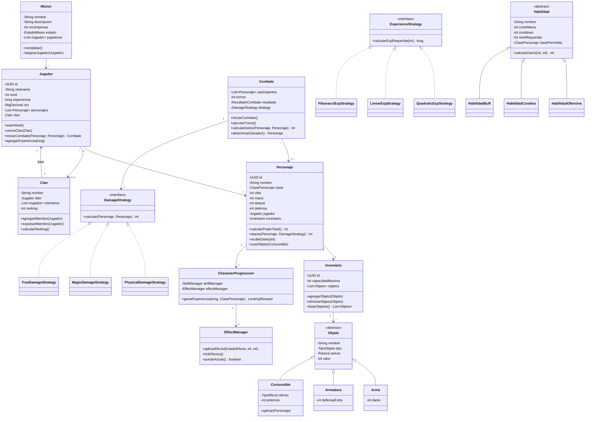

# RPG Online - MMORPG Backend

> Examen de **Entornos de Desarrollo** — Curso DAM  
> **CES Lope de Vega** — Mayo 2026

**Autor:** Martín Hernández Fernández

---

## Índice

1. [Descripción del Proyecto](#descripción-del-proyecto)
2. [Arquitectura](#arquitectura)
3. [Stack Tecnológico](#stack-tecnológico)
4. [Estructura del Proyecto](#estructura-del-proyecto)
5. [Módulos del Sistema](#módulos-del-sistema)
6. [Diagrama UML](#diagrama-uml)
7. [API REST](#api-rest)
8. [Consola Retro ASCII](#consola-retro-ascii)
9. [Persistencia](#persistencia)
10. [Testing](#testing)
11. [Cómo Ejecutar](#cómo-ejecutar)
12. [Decisiones de Diseño](#decisiones-de-diseño)
13. [Trabajo Futuro](#trabajo-futuro)

---

## Descripción del Proyecto

**RPG Online** es un backend para un videojuego RPG multijugador online (MMORPG) desarrollado en Java 21 con Spring Boot 3. El proyecto implementa una arquitectura limpia (Clean Architecture) combinada con Domain-Driven Design (DDD) para construir una base sólida, modular y escalable.

El sistema incluye:

- **Sistema de jugadores y personajes** con progresión por niveles
- **Sistema de combate** por turnos con estrategias de daño intercambiables
- **Sistema de inventario** con objetos jerárquicos (armas, armaduras, consumibles)
- **Sistema de clanes** con gestión de miembros y ranking
- **Sistema de misiones** con estados y recompensas
- **Sistema de economía** con tienda y transacciones
- **Sistema de habilidades** (25 habilidades únicas por clase)
- **Sistema de experiencia** con curvas de progresión escalables
- **Sistema de efectos** con estados alterados (veneno, parálisis, protección...)
- **Persistencia simulada** tipo Prisma ORM con almacenamiento JSON
- **Interfaz de consola retro** estilo Rogue (1980) con menús interactivos
- **API REST** completa con documentación OpenAPI/Swagger

---

## Arquitectura

El proyecto sigue **Clean Architecture** con 4 capas:

```
┌─────────────────────────────────────────────────┐
│               PRESENTATION LAYER                │
│     (Controllers REST + Console Screens)        │
├─────────────────────────────────────────────────┤
│               APPLICATION LAYER                 │
│        (DTOs, Mappers MapStruct)                │
├─────────────────────────────────────────────────┤
│                DOMAIN LAYER                     │
│  (Entities, Enums, Repositories, Services)      │
├─────────────────────────────────────────────────┤
│             INFRASTRUCTURE LAYER                │
│    (JPA, Security, JSON Persistence, Config)    │
└─────────────────────────────────────────────────┘
```

### Principios SOLID Aplicados

| Principio | Implementación |
|-----------|----------------|
| **S** | Cada clase tiene una única responsabilidad |
| **O** | Herencia de Objeto/Habilidad permite extensiones sin modificar código |
| **L** | Arma/Armadura/Consumible sustituyen a Objeto sin alterar comportamiento |
| **I** | Interfaces segregadas: DamageStrategy, ExperienceStrategy, GenericRepository |
| **D** | Domain no depende de infraestructura; repositorios se inyectan como interfaces |

### Patrones de Diseño

| Patrón | Uso |
|--------|-----|
| **Strategy** | Cálculo de daño (Physical, Magic, True) y curvas de experiencia (Quadratic, Linear, Fibonacci) |
| **Factory** | Creación de habilidades (SkillFactory) y recompensas (RewardFactory) |
| **Builder** | Construcción de entidades (Jugador, Personaje, Combate, etc.) |
| **Repository** | Abstracción de persistencia (GenericRepository + implementaciones JPA y JSON) |
| **State** | Gestión de estados alterados en combate (EffectManager) |
| **MVC** | Interfaz de consola (Model → Domain, View → Renderer, Controller → Screens) |
| **DTO** | Transferencia de datos entre capas usando records de Java |
| **Global Exception Handler** | Manejo centralizado de errores con ProblemDetail (RFC 9457) |

---

## Stack Tecnológico

### Backend
- **Java 21** — Última versión LTS con records, pattern matching, switch expressions
- **Spring Boot 3.2.4** — Framework principal
- **Maven** — Gestión de dependencias y construcción
- **Spring Web** — API REST
- **Spring Data JPA / Hibernate** — Persistencia relacional
- **Lombok** — Reducción de boilerplate
- **Jakarta Validation** — Validaciones declarativas
- **MapStruct** — Mapeo DTO ↔ Entidad
- **Jackson** — Serialización JSON

### Base de Datos
- **H2** — Base de datos en memoria para desarrollo y testing
- **PostgreSQL 16** — Base de datos para producción
- **JSON Storage** — Persistencia simulada tipo Prisma ORM

### Seguridad
- **Spring Security** — Preparado para autenticación JWT
- **Roles**: PLAYER, ADMIN, MODERATOR

### Documentación
- **OpenAPI / Swagger** — Documentación interactiva de la API

### Testing
- **JUnit 5** — Framework de tests
- **Mockito** — Mocks para tests unitarios

### DevOps
- **Docker** — Contenedorización
- **Docker Compose** — Orquestación de servicios

---

## Estructura del Proyecto

```
rpg-online/
│
├── pom.xml                              # Configuración Maven
├── Dockerfile                           # Imagen Docker multi-etapa
├── docker-compose.yml                   # Servicios (PostgreSQL)
│
├── src/main/java/com/examenmayo/
│   ├── RpgOnlineApplication.java        # Entry point Spring Boot
│   │
│   ├── config/                          # Configuraciones generales
│   │
│   ├── domain/                          # ──── CAPA DE DOMINIO ────
│   │   ├── enums/                       # Enumeraciones del sistema
│   │   │   ├── ClasePersonaje.java      # GUERRERO, MAGO, ARQUERO, PALADIN, ASESINO
│   │   │   ├── Rareza.java             # COMUN, RARO, EPICO, LEGENDARIO, MITICO
│   │   │   ├── TipoObjeto.java         # ARMA, ARMADURA, CONSUMIBLE
│   │   │   ├── EstadoMision.java       # PENDIENTE, EN_PROGRESO, COMPLETADA
│   │   │   ├── ResultadoCombate.java   # VICTORIA, DERROTA, EMPATE
│   │   │   ├── TipoEfecto.java         # CURACION, MANA, BUFF_ATAQUE, etc.
│   │   │   ├── TipoHabilidad.java      # OFENSIVA, CURATIVA, BUFF, DEBUFF, PASIVA
│   │   │   ├── EstadoEfecto.java       # ENVENENADO, PARALIZADO, PROTEGIDO, etc.
│   │   │   └── Role.java               # PLAYER, ADMIN, MODERATOR
│   │   │
│   │   ├── model/                       # Entidades del dominio
│   │   │   ├── Jugador.java            # Agregado raíz con personajes y clan
│   │   │   ├── Personaje.java          # Estadísticas, combate, inventario
│   │   │   ├── Inventario.java         # Composición de objetos
│   │   │   ├── Objeto.java            # Clase base abstracta
│   │   │   ├── Arma.java              # Especialización con daño
│   │   │   ├── Armadura.java          # Especialización con defensa
│   │   │   ├── Consumible.java        # Especialización con efectos
│   │   │   ├── Clan.java              # Liderazgo y miembros
│   │   │   ├── Combate.java           # Combate por turnos
│   │   │   ├── Mision.java            # Progresión de misiones
│   │   │   ├── DamageStrategy.java    # Interface Strategy
│   │   │   ├── PhysicalDamageStrategy.java
│   │   │   ├── MagicDamageStrategy.java
│   │   │   └── TrueDamageStrategy.java
│   │   │
│   │   ├── experience/                  # Sistema de experiencia
│   │   │   ├── ExperienceStrategy.java # Interface Strategy
│   │   │   ├── QuadraticExpStrategy.java # nivel² * K
│   │   │   ├── LinearExpStrategy.java  # nivel * K
│   │   │   ├── FibonacciExpStrategy.java # fib(n) * K
│   │   │   ├── ExperienceManager.java  # Orquestador de XP
│   │   │   ├── CharacterProgression.java # Progresión completa
│   │   │   ├── LevelUpReward.java      # Recompensas por nivel
│   │   │   └── RewardFactory.java     # Fábrica de recompensas
│   │   │
│   │   ├── skill/                       # Sistema de habilidades
│   │   │   ├── Habilidad.java          # Clase base abstracta
│   │   │   ├── HabilidadOfensiva.java  # Daño con multiplicador
│   │   │   ├── HabilidadCurativa.java  # Curación
│   │   │   ├── HabilidadBuff.java      # Estados alterados
│   │   │   ├── SkillFactory.java       # Fábrica por clase
│   │   │   └── SkillManager.java       # Gestor de habilidades
│   │   │
│   │   ├── effect/                      # Sistema de efectos
│   │   │   ├── StatusEffect.java       # Efecto de estado
│   │   │   └── EffectManager.java      # Gestor de estados alterados
│   │   │
│   │   ├── repository/                  # Interfaces de repositorio
│   │   │   ├── JugadorRepository.java
│   │   │   ├── PersonajeRepository.java
│   │   │   ├── ClanRepository.java
│   │   │   ├── CombateRepository.java
│   │   │   ├── MisionRepository.java
│   │   │   ├── ObjetoRepository.java
│   │   │   └── InventarioRepository.java
│   │   │
│   │   ├── service/                     # Servicios de dominio
│   │   │   ├── PlayerService.java
│   │   │   ├── CharacterService.java
│   │   │   ├── CombatService.java
│   │   │   ├── ClanService.java
│   │   │   ├── MisionService.java
│   │   │   └── ShopService.java
│   │   │
│   │   └── exception/                   # Excepciones personalizadas
│   │       ├── ResourceNotFoundException.java
│   │       ├── BusinessException.java
│   │       ├── InventarioLlenoException.java
│   │       └── OroInsuficienteException.java
│   │
│   ├── application/                     # ──── CAPA DE APLICACIÓN ────
│   │   ├── dto/                         # DTOs como records de Java
│   │   │   ├── JugadorDto.java
│   │   │   ├── PersonajeDto.java
│   │   │   ├── ClanDto.java
│   │   │   ├── CombateDto.java
│   │   │   ├── MisionDto.java
│   │   │   ├── ObjetoDto.java
│   │   │   └── ShopDto.java
│   │   │
│   │   └── mapper/                      # MapStruct mappers
│   │       └── RpgMapper.java
│   │
│   ├── infrastructure/                  # ──── CAPA DE INFRAESTRUCTURA ────
│   │   ├── persistence/json/           # Persistencia simulada
│   │   │   ├── GenericRepository.java  # Interfaz genérica
│   │   │   ├── JsonDatabase.java       # Base de datos JSON
│   │   │   ├── DataStore.java          # Fachada de repositorios
│   │   │   ├── PlayerJsonRepository.java
│   │   │   ├── CharacterJsonRepository.java
│   │   │   ├── ClanJsonRepository.java
│   │   │   ├── MissionJsonRepository.java
│   │   │   └── ItemJsonRepository.java
│   │   │
│   │   ├── security/                    # Seguridad (JWT placeholder)
│   │   │   ├── SecurityConfig.java
│   │   │   └── JwtAuthenticationFilter.java
│   │   │
│   │   └── configuration/              # Configuraciones
│   │       ├── OpenApiConfig.java      # Swagger/OpenAPI
│   │       ├── JpaConfig.java          # JPA auditing
│   │       └── DataInitializer.java    # Datos demo
│   │
│   ├── presentation/                    # ──── CAPA DE PRESENTACIÓN ────
│   │   ├── controller/                  # Controladores REST
│   │   │   ├── PlayerController.java
│   │   │   ├── CharacterController.java
│   │   │   ├── ClanController.java
│   │   │   ├── CombatController.java
│   │   │   ├── MissionController.java
│   │   │   └── ShopController.java
│   │   │
│   │   └── advice/                      # Manejo global de errores
│   │       └── GlobalExceptionHandler.java
│   │
│   └── console/                         # ──── INTERFAZ DE CONSOLA ────
│       ├── GameEngine.java              # Game loop principal
│       ├── renderer/
│       │   └── ConsoleRenderer.java     # Renderer ASCII
│       ├── input/
│       │   └── InputHandler.java       # Captura de teclado
│       └── screens/                     # Pantallas del juego
│           ├── Screen.java             # Clase base
│           ├── MainMenuScreen.java     # Menú principal
│           ├── CharacterScreen.java    # Crear/ver personajes
│           ├── CombatScreen.java       # Combate por turnos
│           ├── InventoryScreen.java    # Ver inventario
│           ├── SkillScreen.java        # Ver habilidades
│           ├── MissionScreen.java      # Gestionar misiones
│           └── ShopScreen.java         # Tienda
│
├── src/main/resources/
│   └── application.yml                  # Configuración Spring (dev/prod/test)
│
└── src/test/java/com/examenmayo/        # Tests unitarios
    ├── RpgOnlineApplicationTests.java
    ├── domain/model/                    # 9 clases de test (26 tests)
    │   ├── JugadorTest.java
    │   ├── PersonajeTest.java
    │   ├── InventarioTest.java
    │   ├── CombateTest.java
    │   ├── MisionTest.java
    │   ├── DamageStrategyTest.java
    │   ├── ArmaTest.java
    │   ├── ConsumibleTest.java
    │   └── PersonajeClaseTest.java
    ├── domain/experience/               # 3 clases de test
    │   ├── ExperienceStrategyTest.java
    │   ├── ExperienceManagerTest.java
    │   └── CharacterProgressionTest.java
    ├── domain/skill/                    # 2 clases de test
    │   ├── SkillManagerTest.java
    │   └── SkillFactoryTest.java
    └── domain/effect/                   # 1 clase de test
        └── EffectManagerTest.java
```

---

## Módulos del Sistema

### Jugadores y Personajes
- Cada jugador puede tener múltiples personajes de distintas clases
- Los personajes tienen estadísticas (vida, maná, ataque, defensa)
- Progresión por niveles con experiencia acumulativa

### Sistema de Experiencia
Tres curvas de progresión implementadas via **Strategy Pattern**:

| Nivel | Quadratic (×100) | Linear (×200) | Fibonacci (×50) |
|-------|-----------------|----------------|-----------------|
| 1     | 100 XP          | 200 XP         | 50 XP           |
| 2     | 400 XP          | 400 XP         | 50 XP           |
| 3     | 900 XP          | 600 XP         | 100 XP          |
| 5     | 2.500 XP        | 1.000 XP       | 250 XP          |
| 10    | 10.000 XP       | 2.000 XP       | 2.750 XP        |

Al subir de nivel se otorgan **recompensas diferenciadas por clase**:
- **Guerrero**: +15 Vida, +3 Maná, +3 Ataque, +2 Defensa
- **Mago**: +5 Vida, +10 Maná, +3 Ataque, +1 Defensa
- **Arquero**: +8 Vida, +5 Maná, +3 Ataque, +1 Defensa
- **Paladín**: +12 Vida, +6 Maná, +2 Ataque, +3 Defensa
- **Asesino**: +7 Vida, +4 Maná, +4 Ataque, +1 Defensa

### Sistema de Habilidades
25 habilidades únicas (5 por clase) con jerarquía de herencia:

```
Habilidad (abstracta)
  ├── HabilidadOfensiva  → daño con multiplicador
  ├── HabilidadCurativa  → curación
  └── HabilidadBuff      → estados alterados
```

**Ejemplos por clase:**

| Clase | Nv.1 | Nv.3 | Nv.5-6 |
|-------|------|------|--------|
| Guerrero | Golpe Poderoso (1.5x) | Tajo Giratorio (2x) | Furia (2.5x) |
| Mago | Bola de Fuego (1.8x) | Rayo Helado | Tormenta de Fuego (3x) |
| Arquero | Flecha Precisa (1.4x) | Lluvia de Flechas (2.2x) | Disparo Penetrante (2.8x) |
| Paladín | Espada Sagrada (1.6x) | Escudo de la Fe | Castigo Divino (2.4x) |
| Asesino | Ataque Furtivo (2x) | Venenoso | Golpe Mortal (3.5x) |

### Sistema de Combate
Combate por turnos con:
- 3 estrategias de daño (físico, mágico, verdadero) — **Strategy Pattern**
- Uso de habilidades con consumo de maná
- Cooldowns entre usos
- Estados alterados (envenenado, paralizado, protegido, etc.) — **State Pattern**
- Cálculo de daño crítico y evasión

### Inventario y Objetos
- Composición mediante inventario con capacidad limitada
- Jerarquía de herencia: Objeto → Arma, Armadura, Consumible
- Rarezas: Común, Raro, Épico, Legendario, Mítico

### Clanes
- Liderazgo, miembros, ranking
- Cálculo automático de ranking basado en nivel de miembros

### Misiones
- Estados: PENDIENTE → EN_PROGRESO → COMPLETADA
- Recompensas en experiencia y oro

### Economía
- Tienda con compra/venta de objetos
- Validación de oro antes de transacciones

---

## Diagrama UML



---

## API REST

| Método | Endpoint | Descripción |
|--------|----------|-------------|
| `GET` | `/players` | Listar todos los jugadores |
| `POST` | `/players` | Crear nuevo jugador |
| `GET` | `/players/{id}` | Obtener jugador por ID |
| `PUT` | `/players/{id}` | Actualizar jugador |
| `DELETE` | `/players/{id}` | Eliminar jugador |
| `POST` | `/players/{id}/level-up` | Subir de nivel |
| `GET` | `/characters` | Listar personajes |
| `GET` | `/characters/{id}` | Obtener personaje |
| `POST` | `/characters/player/{jugadorId}` | Crear personaje para jugador |
| `DELETE` | `/characters/{id}` | Eliminar personaje |
| `POST` | `/characters/{id}/use-item/{objetoId}` | Usar objeto consumible |
| `GET` | `/clans` | Listar clanes |
| `POST` | `/clans?liderId={id}` | Crear clan |
| `GET` | `/clans/{id}` | Obtener clan |
| `POST` | `/clans/{clanId}/members/{jugadorId}` | Agregar miembro |
| `DELETE` | `/clans/{clanId}/members/{jugadorId}` | Expulsar miembro |
| `DELETE` | `/clans/{id}` | Eliminar clan |
| `GET` | `/combats` | Listar combates |
| `POST` | `/combats` | Iniciar combate |
| `GET` | `/combats/{id}` | Obtener resultado |
| `GET` | `/missions` | Listar misiones |
| `POST` | `/missions` | Crear misión |
| `GET` | `/missions/{id}` | Obtener misión |
| `POST` | `/missions/{missionId}/assign/{jugadorId}` | Asignar misión |
| `POST` | `/missions/{id}/complete` | Completar misión |
| `GET` | `/missions/status/{estado}` | Filtrar por estado |
| `GET` | `/missions/player/{jugadorId}` | Misiones de jugador |
| `DELETE` | `/missions/{id}` | Eliminar misión |
| `GET` | `/shop/catalog` | Ver catálogo |
| `POST` | `/shop/buy` | Comprar objeto |
| `POST` | `/shop/sell` | Vender objeto |

Documentación interactiva disponible en: `http://localhost:8080/swagger-ui.html`

---

## Consola Retro ASCII

Además de la API REST, el proyecto incluye una **interfaz de consola** estilo Rogue (1980) con menús interactivos y arte ASCII.

```
#################################
#         RPG ONLINE            #
#################################
# 1. Características            #
# 2. Combate                    #
# 3. Inventario                 #
# 4. Habilidades                #
# 5. Misiones                   #
# 6. Tienda                     #
# 7. Salir                      #
#################################
Selecciona una opción:
```

### Pantallas disponibles
- **Menú Principal** — Navegación entre todas las opciones
- **Progresión** — Crear jugadores/personajes, ver estadísticas
- **Combate** — Combate por turnos con habilidades y efectos
- **Inventario** — Visualizar objetos de cada personaje
- **Habilidades** — Explorar el árbol de habilidades por clase
- **Misiones** — Gestionar y crear misiones
- **Tienda** — Comprar objetos del catálogo

### Cómo ejecutar la consola
```bash
# Desde la raíz del proyecto
java -cp rpg-online/target/rpg-online-1.0.0.jar com.examenmayo.console.GameEngine
```

---

## Persistencia

### Perfiles de Spring

| Perfil | Base de Datos | Uso |
|--------|---------------|-----|
| `dev` (default) | H2 en memoria | Desarrollo |
| `prod` | PostgreSQL 16 | Producción |
| `test` | H2 | Tests |

### Persistencia Simulada (JSON)

Además de JPA, el proyecto incluye un sistema de persistencia alternativo inspirado en **Prisma ORM**:

- **JsonDatabase**: Almacena datos en archivos `data/*.json`
- **GenericRepository\<T\>**: Interfaz genérica que abstrae el almacenamiento
- **DataStore**: Fachada que expone 5 repositorios concretos

**Ventajas:**
- No requiere base de datos instalada
- Fácil de depurar (los archivos JSON son legibles)
- Preparado para migrar: solo hay que implementar GenericRepository con JPA

---

## Testing

El proyecto incluye **32 tests unitarios** con JUnit 5 y Mockito:

### Tests de Dominio (26 tests)
| Clase | Tests | Cobertura |
|-------|-------|-----------|
| `JugadorTest` | 7 | Subir nivel, unirse clan, experiencia, oro |
| `PersonajeTest` | 6 | Poder total, ataque, daño, objetos, estado |
| `InventarioTest` | 3 | Agregar/eliminar objetos, límite capacidad |
| `CombateTest` | 4 | Inicio, turnos, ganador, estrategias |
| `MisionTest` | 3 | Asignar, completar, validaciones |
| `DamageStrategyTest` | 3 | Físico, mágico, verdadero |
| `ArmaTest` | 1 | Creación de arma |
| `ConsumibleTest` | 2 | Curación, revivir |
| `PersonajeClaseTest` | 2 | Atributos por clase |

### Tests de Experiencia (3 clases)
| Clase | Tests | Cobertura |
|-------|-------|-----------|
| `ExperienceStrategyTest` | 3 | Quadratic, Linear, Fibonacci |
| `ExperienceManagerTest` | 4 | Cálculo XP, niveles múltiples |
| `CharacterProgressionTest` | 4 | Progresión, desbloqueo habilidades |

### Tests de Habilidades (2 clases)
| Clase | Tests | Cobertura |
|-------|-------|-----------|
| `SkillFactoryTest` | 5 | Creación por clase, tipos, daño |
| `SkillManagerTest` | 6 | Desbloqueo, maná, cooldown, uso |

### Tests de Efectos (1 clase)
| Clase | Tests | Cobertura |
|-------|-------|-----------|
| `EffectManagerTest` | 6 | Aplicar, tick, expirar, daño extra, defensa, parálisis |

---

## Cómo Ejecutar

### Requisitos
- Java 21+
- Maven 3.8+
- Docker (opcional, para PostgreSQL)

### Desarrollo (con H2)
```bash
cd rpg-online
mvn spring-boot:run
# API disponible en: http://localhost:8080
# Consola H2: http://localhost:8080/h2-console
# Swagger: http://localhost:8080/swagger-ui.html
```

### Producción (con PostgreSQL)
```bash
docker-compose up -d          # Inicia PostgreSQL
mvn spring-boot:run -Dspring-boot.run.profiles=prod
```

### Tests
```bash
mvn test
```

### Package
```bash
mvn clean package
java -jar target/rpg-online-1.0.0.jar
```

---

## Decisiones de Diseño

### UUID como identificadores
- **Problema**: Auto-increment no escala en sistemas distribuidos
- **Solución**: UUID para todas las entidades, sin dependencia de secuencias

### SINGLE_TABLE para herencia de Objeto
- **Problema**: JOINED/TABLE_PER_CLASS tienen penalización de rendimiento
- **Solución**: SINGLE_TABLE con @DiscriminatorColumn para consultas rápidas

### Strategy Pattern para daño y experiencia
- **Problema**: Diferentes tipos de daño/XP acoplan el código
- **Solución**: Interfaces Strategy intercambiables en tiempo de ejecución

### CharacterProgression como wrapper
- **Problema**: Modificar Personaje (entidad JPA) añade complejidad
- **Solución**: Clase separada que compone XP + Skills + Efectos

### MVC en la consola
- **Problema**: La lógica de UI mezclada con la de negocio
- **Solución**: Renderer (vista) + Screens (controlador) + Domain (modelo)

---

## Trabajo Futuro

- [ ] **Autenticación JWT** — Implementar el filtro de seguridad con tokens
- [ ] **WebSockets** — Combate multiplayer en tiempo real
- [ ] **Redis** — Caché para rankings, sesiones y catálogo
- [ ] **Event Sourcing** — CombatEvent, TradeEvent, LevelUpEvent
- [ ] **CQRS** — Read models optimizados para consultas
- [ ] **Matchmaking** — Sistema de emparejamiento PvP
- [ ] **Migración PostgreSQL** — Reemplazar persistencia JSON por JPA real
- [ ] **Internacionalización** — Soporte multi-idioma con ResourceBundle

---

> **Examen de Entornos de Desarrollo** — Curso DAM  
> **CES Lope de Vega** — Mayo 2026  
> *Martín Hernández Fernández*
